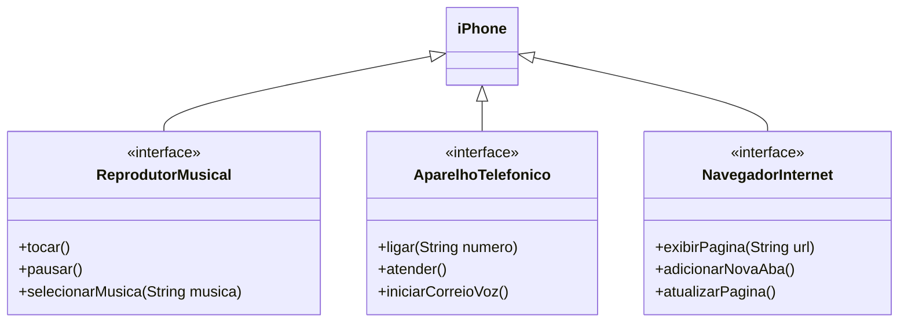

# IPhone com IML
Pequeno projeto para fortalecer conhecimentos com diagramas de classes.

## Tecnologias

* Java 1.8
* Mermaid

## Diagrama UML

```mermaid
classDiagram
    class iPhone {
    }

    class ReprodutorMusical {
    <<interface>>
        +tocar()
        +pausar()
        +selecionarMusica(String musica)
    }

    class AparelhoTelefonico {
    <<interface>>
        +ligar(String numero)
        +atender()
        +iniciarCorreioVoz()
    }

    class NavegadorInternet {
    <<interface>>
        +exibirPagina(String url)
        +adicionarNovaAba()
        +atualizarPagina()
    }

    iPhone <|-- ReprodutorMusical
    iPhone <|-- AparelhoTelefonico
    iPhone <|-- NavegadorInternet
```